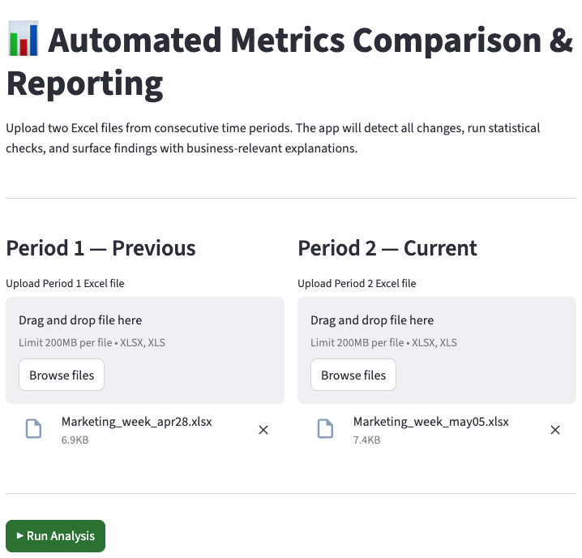
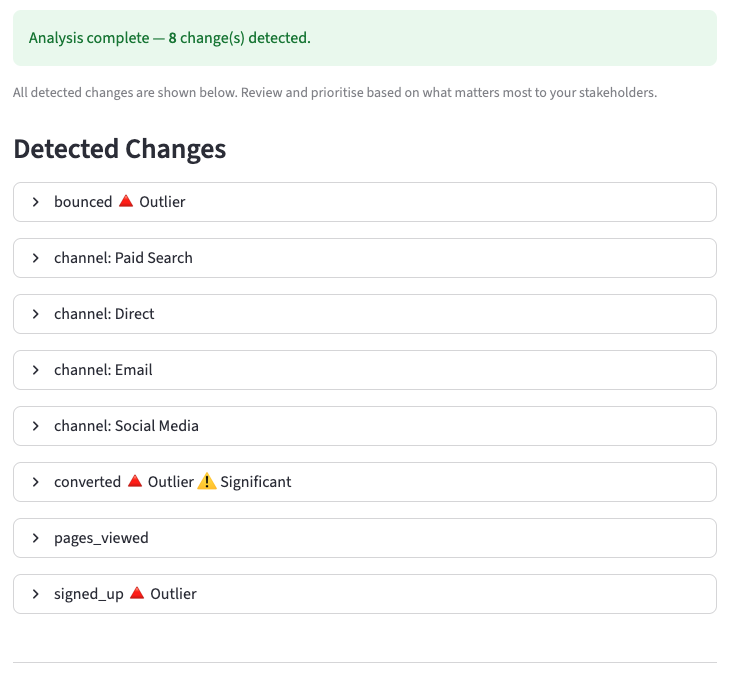
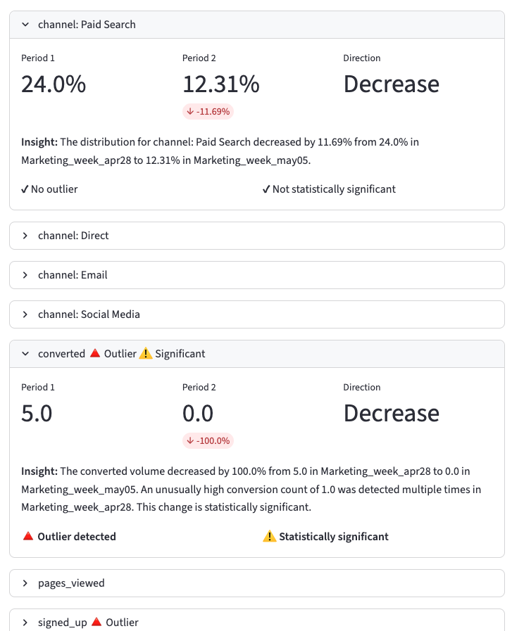
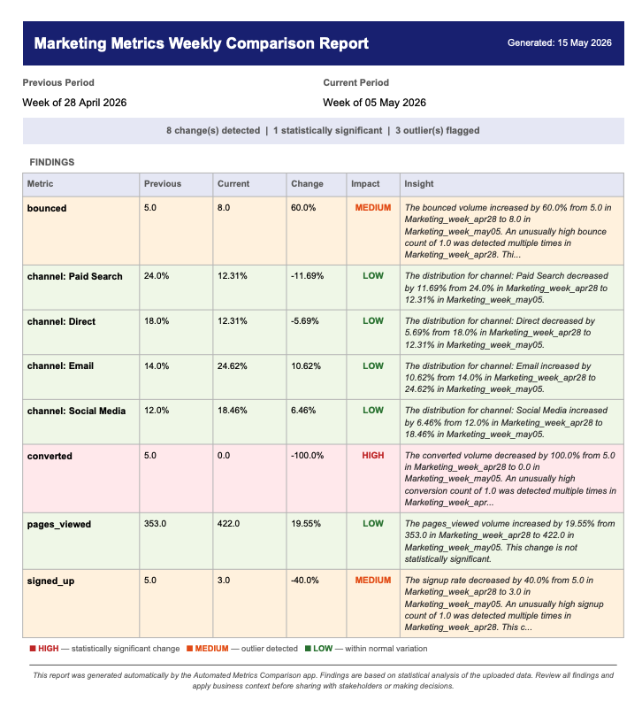

# Automated Metrics Comparison and Reporting

> A GenAI-powered app that compares two Excel datasets across time periods, detects all changes, and generates a narrative-driven PDF report for analyst review — replacing a hours-long manual workflow.

---

## Table of Contents
- [Setup and Usage](#setup-and-usage)
- [Context, User, and Problem](#context-user-and-problem)
- [Solution and Design](#solution-and-design)
- [Evaluation and Results](#evaluation-and-results)
- [Artifact Snapshot](#artifact-snapshot)

---

## Setup and Usage

### Prerequisites
- Python 3.9 or higher
- A [Google Gemini API key](https://aistudio.google.com/app/apikey) — the app uses Gemini for analysis and narrative generation

---

### 1. Clone the Repository

```bash
git clone https://github.com/Lara-akanni/Automated-Metrics-Reporting.git
cd Automated-Metrics-Reporting
```

---

### 2. Create and Activate a Virtual Environment

```bash
# Create the environment
python -m venv venv

# Activate it — Mac/Linux
source venv/bin/activate

# Activate it — Windows
venv\Scripts\activate
```

---

### 3. Install Dependencies

```bash
pip install -r requirements.txt
```

The key packages used by this project are:

| Package | Purpose |
|---|---|
| `streamlit` | Web app interface |
| `pandas` | Excel file parsing and delta computation |
| `openpyxl` | Reading `.xlsx` files |
| `google-genai` | Gemini API client (LLM + tool use) |
| `reportlab` | PDF report generation |
| `scipy` | Statistical significance testing |

---

### 4. Set Your API Key

This app requires a **Google Gemini API key**. Get one for free at [Google AI Studio](https://aistudio.google.com/app/apikey).

**Step 1 — Copy the example file:**
```bash
cp .env.example .env
```

**Step 2 — Open `.env` and replace the placeholder with your real key:**
```
GEMINI_API_KEY=your_actual_key_here
```

> ⚠️ `.env` is listed in `.gitignore` and will never be committed to the repository. Never share or publish this file — it contains your private API key. The `.env.example` file shows the required format but does not contain a real key.

---

### 5. Run the App

```bash
streamlit run app.py
```

The app will open automatically in your browser at `http://localhost:8501`.

---

### 6. Try It with the Sample Files

Sample Excel file pairs are included in the `sample_data/` folder so you can run the app immediately without preparing your own data:

```
sample_data/
  example1_product_metrics/
    Product_week_apr28.xlsx   ← baseline period
    Product_week_may05.xlsx   ← comparison period
  example2_marketing_metrics/
    Marketing_week_apr28.xlsx
    Marketing_week_may05.xlsx
  example3_revenue_mom/
    Revenue_april_2025.xlsx
    Revenue_may_2025.xlsx
  example4_mixed/
    Mixed_april_2025.xlsx
    Mixed_may_2025.xlsx
```

**Steps (using Example 1 — Product Metrics):**
1. In the app, click **Browse files** under **Period 1** and upload `Product_week_apr28.xlsx`
2. Click **Browse files** under **Period 2** and upload `Product_week_may05.xlsx`
3. Click **▶ Run Analysis**
4. Review the findings displayed on screen — each finding shows Period 1 vs Period 2 values, the change direction, statistical significance, and a plain-English explanation

Example 1 contains product payment data with a deliberate success rate drop and satisfaction score dip — upload both files to verify the app detects them correctly.

---

### Project Structure

```
Automated-Metrics-Reporting/
├── app.py                  # Streamlit app entry point
├── analysis.py             # Parse → align → delta → LLM tool loop
├── baseline.py             # Prompt-only baseline (no tools) for comparison
├── run_baseline.py         # Terminal runner for the prompt-only baseline
├── tools.py                # Backend math functions called by the LLM
├── report.py               # PDF generation from structured findings
├── report.md               # PDF design spec and change log
├── evals.py                # Automated scoring against ground truth
├── requirements.txt        # Python dependencies
├── .env.example            # API key template — copy to .env and fill in
├── eval_set.md             # Human-readable evaluation test cases
├── eval_rubric.md          # Scoring rubric (2 dimensions, max 6 points)
├── test_findings.md        # Manual test log — all 4 runs with scores
├── project_plan.md         # Full project plan and design decisions
├── create_sample_data.py   # Script to regenerate synthetic Excel test files
├── screenshots/            # App artifact screenshots for README
├── eval_cases/             # Ground truth JSON + Excel pairs for automated eval
│   ├── example1_product/
│   ├── example2_marketing/
│   ├── example3_revenue/
│   └── example4_mixed/
└── sample_data/            # Synthetic Excel file pairs for manual testing
    ├── example1_product_metrics/
    ├── example2_marketing_metrics/
    ├── example3_revenue_mom/
    └── example4_mixed/
```

---

## Context, User, and Problem

### Who the User Is
The primary user is a **data analyst** responsible for producing periodic performance reports (weekly, monthly, or quarterly) for executives and functional leads — including marketing, product, and finance stakeholders.

### The Workflow Being Improved
Each reporting cycle, the analyst receives two Excel files representing the same set of metrics from two consecutive time periods. The current manual workflow looks like this:

1. Open both Excel files side by side
2. Write delta formulas to compute the difference for each metric
3. Apply conditional formatting to visually scan for outliers
4. Decide which findings are most important based on personal judgment
5. Write narrative explanations from scratch in a separate document
6. Assemble everything into a shareable report

This process is repeated across multiple report types in a single cycle — traffic and signups for marketing, success rates for product, revenue breakdowns for finance — each requiring the same manual effort.

### Why It Matters
The manual process has three core problems:

| Problem | Impact |
|---|---|
| **Time-consuming** | Hours per reporting cycle, multiplied across report types |
| **Error-prone** | Manual delta formulas and subjective outlier spotting introduce mistakes |
| **Inconsistent** | Report quality and depth depend on the analyst's bandwidth and judgment that day |

A better system saves time, reduces errors, standardises report quality, and surfaces the most important findings automatically — so the analyst can focus on review and decision-making rather than data wrangling.

---

## Solution and Design

### What Was Built
A web app (built with **Streamlit**) where the analyst uploads two Excel files and receives a downloadable PDF report. No manual configuration is required — the app detects column types and dataset structure automatically.

### How It Works

```
[Upload Period 1 Excel] + [Upload Period 2 Excel]
            │
            ▼
  Parse files → Align columns by name
  Flag columns that exist in only one file
            │
            ▼
  Numeric columns  →  Compute raw deltas
  Categorical columns  →  Flag value changes
            │
            ▼
  LLM calls backend tools:
    • compute_percentage_change()
    • detect_outliers()          ← interquartile range method
    • run_significance_test()
            │
            ▼
  LLM returns structured JSON findings
  (each finding: metric, prev value, curr value, delta,
   direction, outlier flag, significance flag, narrative explanation)
            │
            ▼
  App formats all findings into PDF report
            │
            ▼
  [Analyst reviews findings and decides what matters most]
  [Analyst downloads and shares PDF with stakeholders]
```

### Key Design Choices

**1. Structured Outputs (JSON)**
The LLM is prompted to return all findings as strict JSON rather than freeform prose. Each finding object includes: `metric_name`, `previous_value`, `current_value`, `delta`, `direction`, `is_outlier`, `is_significant`, and `explanation`. This ensures a consistent, machine-readable format that assembles reliably into a PDF regardless of the dataset domain.

**2. Tool Use / Function Calling**
Rather than asking the LLM to compute statistics itself (which would be unreliable), the LLM is given access to three backend functions it calls during analysis. This keeps the maths deterministic and auditable while letting the LLM focus on explanation.

**3. Analyst-led prioritisation**
The app does not attempt to rank or prioritise findings by business importance — that judgment requires domain context the LLM does not have. Instead, all detected changes are surfaced and clearly explained, leaving prioritisation to the analyst who knows their stakeholders.

**4. No-configuration Design**
The analyst does not need to specify column types, stakeholder audience, or domain. The app infers all of this from the data. This means the same pipeline works for a marketing report and a revenue report without reconfiguration.

**5. Built-in Guardrails**
- Refuses to run if column overlap between the two files is below 50%
- Returns a clear "no significant changes found" message instead of fabricating findings
- Normalises categorical values to lowercase before comparison to avoid false positives from formatting differences (e.g. `"active"` vs `"Active"` vs `"ACTIVE"`)

---

## Evaluation and Results

### Baselines Being Compared Against
Two baselines were used — one for time, one for quality. Full details and results are in the Baselines and Results sections below.

### Evaluation Rubric
Each test run is scored on two dimensions, each rated 1–3, for a maximum of **6 points**. A score of **5 or higher** indicates strong performance.

| Dimension | What It Measures | 1 | 2 | 3 |
|---|---|---|---|---|
| **Change Detection** | Did the app correctly identify all major numeric and categorical changes? | Missed key changes | Caught most | Caught all |
| **Explanation Quality** | Are the narrative explanations clear and business-relevant? | Unclear or generic | Acceptable | Clear and specific |

### Test Cases
The evaluation uses **4 synthetic Excel file pairs** with engineered, known changes — making scoring against ground truth fully objective. Test cases span:
- Product metrics (success rate, customer satisfaction, response time, transaction amount)
- Marketing metrics (traffic volume, signup rate, conversion rate, channel distribution)
- Revenue metrics (total revenue, product line breakdown, transaction status)
- Mixed datasets with both numeric and categorical columns (account status, NPS score, volume)

Ground truth JSON files are stored in `eval_cases/` and used by `evals.py` for automated Change Detection scoring. Explanation Quality is scored manually after reviewing each run.

---

### Baselines

Two baselines were used:

**1. Manual Excel workflow (time baseline only)**
The same analysis performed manually takes approximately 45 minutes per file pair: opening both files side by side, writing delta formulas, scanning for outliers, and drafting narrative explanations. The app completes the same analysis in under 2 minutes. This baseline measures time saved — not output quality.

**2. Prompt-only Gemini (quality baseline)**
The same Gemini model was run on the same file pairs with no tools and no structured output — just a direct prompt asking it to compare the data. This is implemented in `baseline.py` and run via `python3 run_baseline.py`. The purpose is to isolate the value of tool use and structured JSON output specifically.

The prompt-only baseline was run on Example 1 (Product Metrics). It returned **90 findings** (vs the app's 5), with `Previous` and `Current` values listed as "unknown" across all findings — the model returned markdown prose that was parsed into fragments. No percentage changes, outlier flags, or significance flags were present. The output was not usable by a stakeholder. The same structural failure was observed in automated eval runs across all 4 examples (65–86 findings returned per case).

---

### Results

**Overall scores (after iterative fixes)**

| Test Case | Change Detection | Explanation Quality | Total | Pass (5+)? |
|---|---|---|---|---|
| Example 1 — Product Metrics | 3 / 3 | 3 / 3 | 6 / 6 | ✅ Yes |
| Example 2 — Marketing Metrics | 3 / 3 | 3 / 3 | 6 / 6 | ✅ Yes |
| Example 3 — Revenue MoM | 3 / 3 | 3 / 3 | 6 / 6 | ✅ Yes |
| Example 4 — Mixed | 3 / 3 | 3 / 3 | 6 / 6 | ✅ Yes |
| **Average** | **3.0 / 3** | **3.0 / 3** | **6.0 / 6** | **4 / 4** |

**Comparison to prompt-only baseline (Example 1)**

| Dimension | App (tool use + JSON) | Baseline (prompt-only) |
|---|---|---|
| Findings returned | 5 | 90 |
| Previous / Current values | Actual values with % changes | "unknown" for all findings |
| Output format | Structured JSON → clean UI cards + PDF | Markdown fragments |
| Change Detection score | 3 / 3 | 1 / 3 |
| Explanation Quality score | 3 / 3 | 1 / 3 |
| **Total** | **6 / 6** | **2 / 6** |

**What the app did well**
- Correctly detected all engineered changes across all 4 domains without reconfiguration
- Statistical flags (`is_outlier`, `is_significant`) were selective — not every finding was flagged
- Explanations were domain-appropriate (marketing language for marketing files, revenue language for revenue files) after prompt iteration
- NPS scores were correctly bucketed into Promoters / Passives / Detractors
- PDF layout was clean across all examples — no overflow, correct page numbers

**Where it struggled and what was fixed during testing**
- Early runs flagged every finding as significant — fixed by constraining the prompt to only set flags from tool results
- Categorical changes were initially described as "percentage points" instead of "%" — fixed in the system prompt
- Currency symbols were missing from revenue insights on first run — fixed via column type hints
- The `score` column name was too generic for the LLM to produce meaningful insights — fixed by renaming to `account_health_score` in the sample data
- Example 1 automated Change Detection score was 2/3 due to a keyword matching artefact in `evals.py` — manual testing confirmed all 4 changes were detected (3/3)

**Where a human should stay involved**
The app surfaces findings and explanations but does not prioritise or act on them. The analyst must still:
- Decide which findings matter most for their specific stakeholders
- Apply business context the model cannot know (e.g. a revenue drop that is expected due to seasonality)
- Verify outlier findings against raw data before sharing with executives
- Judge whether a statistically significant change is also practically significant

The app is a decision-support tool, not a decision-making one.

---

## Artifact Snapshot

All screenshots below are from a live run using the Marketing Metrics sample files (`Marketing_week_apr28.xlsx` vs `Marketing_week_may05.xlsx`).

---

### 1. Upload the Files



The analyst uploads two Excel files — Period 1 (previous) and Period 2 (current). No configuration required.

---

### 2. Changes Detected



The app returns all detected changes as expandable cards. Outlier and significance badges are shown inline so the analyst can triage at a glance.

---

### 3. Finding Detail



Each finding shows the previous and current values, the percentage change, direction, and a plain-English insight explaining what changed and by how much — framed in the domain language of the report.

---

### 4. PDF Report



The downloadable PDF report includes a header bar with report title and date, a period strip, a summary row, a findings table colour-coded by impact level (High / Medium / Low), and a footer disclaimer.

---

## Author
Rofiah Omolara Akanni
